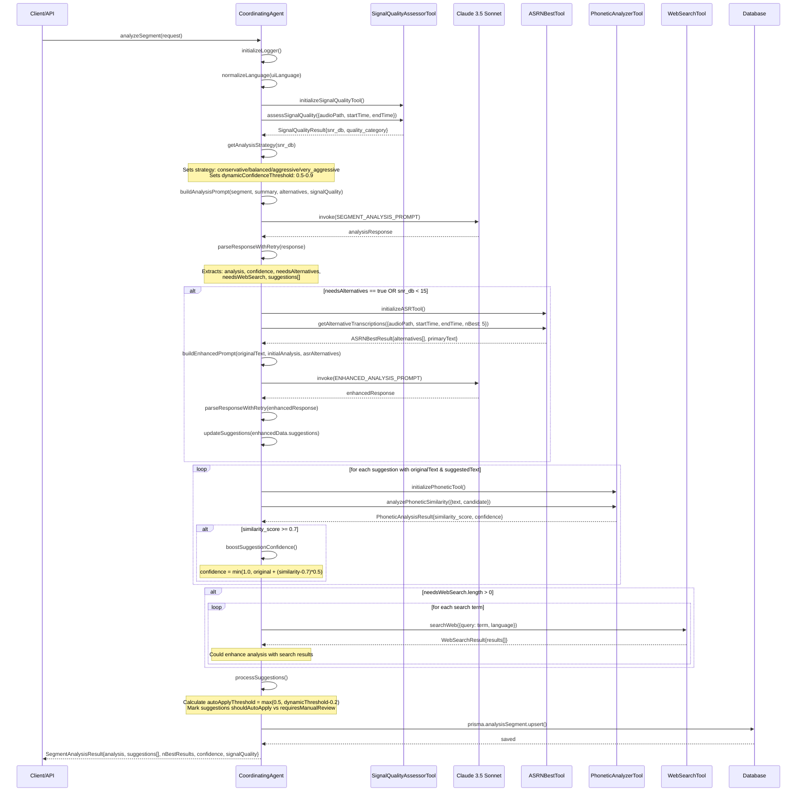

# Agent Analysis: Estonian ASR UI Transcript Analysis System

## Overview

This document provides a comprehensive analysis of the agent-based transcript analysis system in the Estonian ASR UI project. The system uses a coordinating agent with multiple specialized tools to analyze and improve ASR transcript quality through intelligent error detection and correction suggestions.

## Agents Used in Current Code

### 1. CoordinatingAgent (`src/lib/agents/coordinatingAgent.ts:355`)

The main agent responsible for transcript analysis. Used in two contexts:

- **Auto-analysis after ASR completion**: Called via `/api/transcript-analysis/auto-analyze` route when `autoAnalyze` flag is set on a file
- **Manual analysis**: From the files/ai/[fileId] route (though the main endpoint currently returns 501 and redirects to auto-analyze)

**Key Features:**

- Language-aware analysis (supports Estonian, English, Finnish)
- Adaptive correction strategy based on audio quality
- Multi-tool integration for comprehensive analysis
- Dynamic confidence thresholds
- Batch processing capability (up to 5 segments simultaneously)

### 2. SummaryGenerator (`getSummaryGenerator()`)

A prerequisite agent used before detailed segment analysis:

- Generates transcript summaries that provide context for segment analysis
- Only runs once per file, reuses existing summaries
- Essential for contextual understanding of individual segments

## Tools Available to CoordinatingAgent

The coordinating agent has access to 6 specialized tools:

### 1. ASR N-Best Server Node Tool (`asrNBestServerNode.ts`)

**Purpose**: Retrieves alternative transcription hypotheses from the ASR system

**When Used**:

- When LLM determines `needsAlternatives: true`
- When signal quality is poor (SNR < 15dB)

**Functionality**:

- Slices audio segments using AudioSlicer
- Calls EST-ASR backend API at `https://tekstiks.ee/asr/transcribe/alternatives`
- Returns up to 5 alternative transcriptions with confidence scores
- Enables enhanced analysis when original transcription may be unreliable
- Saves debug files for analysis review

### 2. Phonetic Analyzer Tool (`phoneticAnalyzer.ts`)

**Purpose**: Analyzes phonetic similarity between words to detect ASR errors

**When Used**: Applied to all high-confidence suggestions with both original and suggested text

**Functionality**:

- Uses Estonian G2P (grapheme-to-phoneme) system via Python script
- Calculates phonetic similarity scores (0.0-1.0)
- Boosts suggestion confidence for phonetically similar alternatives (≥0.7 similarity)
- Identifies likely homophones and phonetic ASR errors
- Provides fallback analysis when Python tools unavailable

**Key Thresholds**:

- Similarity ≥ 0.7: Applies confidence boost
- Maximum boost: 0.15 (when similarity = 1.0)
- Boost formula: `(similarity_score - 0.7) * 0.5`

### 3. Signal Quality Assessor Tool (`signalQualityAssessor.ts`)

**Purpose**: Assesses audio quality to guide correction strategy

**When Used**: First step in every segment analysis to determine approach

**Functionality**:

- Calculates Signal-to-Noise Ratio (SNR) using Python/TorchMetrics
- Provides quality categories (excellent/good/fair/poor/very_poor)
- Sets dynamic confidence thresholds based on audio quality
- Guides analysis strategy selection
- Includes additional metrics (peak amplitude, clipping detection, etc.)

**Quality Categories & Strategies**:

| SNR Range | Category  | Strategy        | Confidence Threshold |
| --------- | --------- | --------------- | -------------------- |
| ≥30dB     | Excellent | Conservative    | 0.9                  |
| 20-30dB   | Good      | Balanced        | 0.8                  |
| 15-20dB   | Fair      | Balanced        | 0.7                  |
| 10-15dB   | Poor      | Aggressive      | 0.6                  |
| <10dB     | Very Poor | Very Aggressive | 0.5                  |

### 4. Web Search Tool (`webSearch.ts`)

**Purpose**: Search for information about unfamiliar terms

**When Used**: When LLM analysis indicates `needsWebSearch` with specific terms

**Functionality**:

- Uses DuckDuckGo search API
- Language-specific site restrictions (.ee for Estonian, .fi for Finnish)
- Helps validate proper nouns and technical terms
- Supports multilingual search contexts

### 5. TipTap Transaction Tool Direct (`tiptapTransaction.ts`)

**Purpose**: Apply text changes to the editor using ProseMirror transactions

**When Used**: For manual suggestion application (not used in auto-analysis)

**Functionality**:

- Creates diff nodes showing original vs suggested text
- Handles different change types (text replacement, speaker changes, punctuation, grammar)
- Always requires user approval - never directly replaces text
- Provides transaction rollback capabilities

### 6. Text Replacement Test Harness

**Purpose**: Testing and validation of text replacement functionality

**When Used**: Called via `runTests()` method for debugging and validation

## Decision Flow & Sequence Diagram

The coordinating agent follows a sophisticated decision tree:

## Key Decision Points & Criteria

### Decision Point 1: Use ASR N-Best Tool?

**Criteria:**

- LLM sets `needsAlternatives: true` in analysis response
- **OR** Signal quality is poor (SNR < 15dB)

**Impact:** Triggers enhanced analysis with alternative transcription hypotheses

### Decision Point 2: Apply Phonetic Analysis?

**Criteria:**

- Suggestion has both `originalText` and `suggestedText` fields
- PhoneticAnalyzerTool is available

**Impact:** Can boost suggestion confidence by up to 15% for phonetically similar pairs

### Decision Point 3: Perform Web Search?

**Criteria:**

- LLM sets `needsWebSearch` array with search terms
- WebSearchTool is available

**Impact:** Provides additional context for unfamiliar terms

### Decision Point 4: Auto-apply vs Manual Review?

**Criteria:**

- Auto-apply threshold = `max(0.5, dynamicConfidenceThreshold - 0.2)`
- Suggestions above threshold: `shouldAutoApply = true`
- Suggestions below threshold: `requiresManualReview = true`

## Analysis Workflow

The complete analysis workflow follows these steps:

1. **Initialization**: Set up logger, normalize language codes, extract language names
2. **Signal Quality Assessment**: Determine analysis strategy based on audio SNR
3. **Initial LLM Analysis**: Analyze transcript segment using Claude 3.5 Sonnet with language-specific prompts
4. **ASR Enhancement** (conditional): Use N-best alternatives for improved analysis when needed
5. **Phonetic Validation**: Validate all suggestions using phonetic similarity analysis
6. **Web Search** (conditional): Look up unfamiliar terms for additional context
7. **Suggestion Processing**: Calculate thresholds and mark suggestions for auto-application or manual review
8. **Database Storage**: Save analysis results to `AnalysisSegment` table with full metadata

## Critical Thresholds Summary

### Auto-Apply Thresholds by Audio Quality

| Audio Quality (SNR) | Strategy        | Confidence Threshold | Auto-Apply Threshold |
| ------------------- | --------------- | -------------------- | -------------------- |
| ≥30dB               | Conservative    | 0.9                  | 0.7                  |
| 20-30dB             | Balanced        | 0.8                  | 0.6                  |
| 15-20dB             | Balanced        | 0.7                  | 0.5                  |
| 10-15dB             | Aggressive      | 0.6                  | 0.5                  |
| <10dB               | Very Aggressive | 0.5                  | 0.5                  |

### Tool Activation Criteria

- **Signal Quality Tool**: Always used (unless unavailable)
- **ASR N-Best Tool**: `needsAlternatives: true` OR `snr_db < 15`
- **Phonetic Analyzer**: All suggestions with `originalText` and `suggestedText`
- **Web Search**: `needsWebSearch.length > 0`
- **TipTap Transaction**: Manual suggestion application only

### Confidence Boost Rules

- **Phonetic Similarity**: Boost when similarity ≥ 0.7
- **Boost Formula**: `min(1.0, originalConfidence + (similarity - 0.7) * 0.5)`
- **Maximum Boost**: 0.15 points (when perfect phonetic match)

## Multi-Segment Analysis

The system also supports analyzing multiple segments (up to 5) simultaneously:

- Uses `MULTI_SEGMENT_ANALYSIS_PROMPT` for cross-segment consistency
- Each suggestion includes `segmentNumber` for proper attribution
- Supports enhanced analysis with ASR alternatives across all segments
- Maintains individual segment results while providing overall analysis

## Language Support

The system is fully internationalized:

- **Supported Languages**: Estonian (et), English (en), Finnish (fi)
- **Language-specific Prompts**: All LLM prompts adapted to response language
- **Critical Requirement**: All AI responses must be in the target language
- **Fallback**: Defaults to Estonian for transcript analysis, English for UI

## Error Handling & Resilience

The system includes comprehensive error handling:

- **JSON Parsing**: Robust parsing with retry mechanisms and LLM self-correction
- **Tool Failures**: Graceful degradation with fallback results
- **Timeout Handling**: Configurable timeouts for all external tools
- **Logging**: Comprehensive logging via AgentFileLogger for debugging
- **Cleanup**: Automatic cleanup of temporary audio files

## Performance Considerations

- **Concurrent Analysis**: Supports parallel processing of multiple segments
- **Tool Initialization**: Lazy loading of server-side tools to avoid client-side issues
- **Caching**: Results cached in database with upsert operations
- **Resource Management**: Proper cleanup of audio slices and temporary files

This system represents a sophisticated approach to ASR error correction that adapts its behavior based on audio quality, leverages multiple validation techniques, and provides transparent decision-making through comprehensive logging and user-controlled application of suggestions.

## Codebase Status

### ✅ Clean Codebase

The agent system has been streamlined and all legacy files have been removed:

- **Main Agent**: `CoordinatingAgent` (renamed from CoordinatingAgentSimple) in `coordinatingAgent.ts`
- **Tools**: All current tools are actively used and properly organized
- **Exports**: Clean tool exports with appropriate client/server separation
- **Documentation**: All documentation updated to reflect current architecture

### Migration Completed

The codebase has successfully migrated from:

- LangGraph-based architecture → Direct LLM implementation
- Multiple coordination patterns → Single streamlined `CoordinatingAgent`
- Mixed tool versions → Current, well-maintained tool implementations
